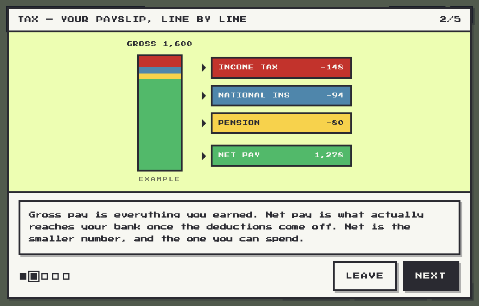
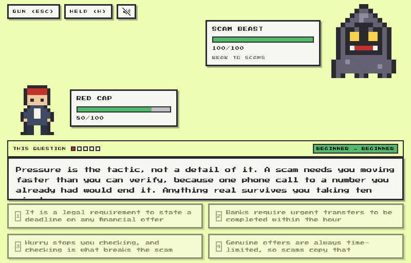
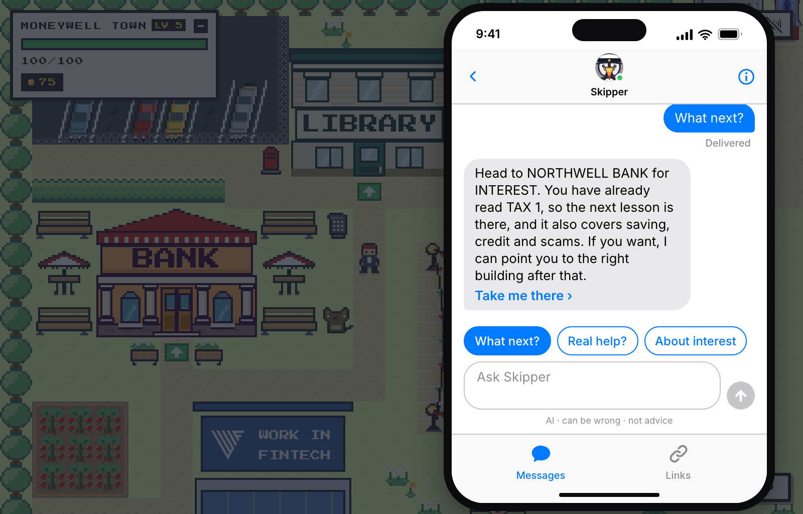
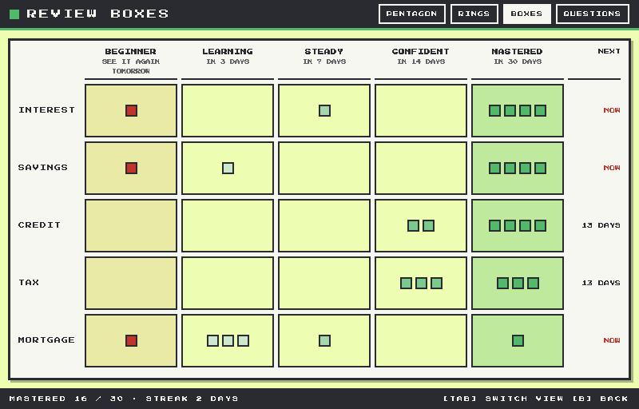

# Moneywell Town

A browser game that teaches UK teenagers how money works: interest, saving,
credit, tax, mortgages and scams. You learn a topic from someone in town, then
walk into the outskirts where creatures quiz you on it.

> This is the first version, built in about a week for the Work in Fintech AI
> Summit hackathon on 28 August 2026, where it won first place. We are
> presenting at Web Summit Lisbon in November as an ALPHA startup, and the
> product we are building from here is a great deal larger than what a week
> could hold.

## What we built in a week

Six topics sit across seven buildings. Three of them teach: the bank covers
interest, saving, credit and scams, the accountant covers tax, the mortgage
broker covers mortgages. The other four teach nothing and say so.

In the outskirts the quiz is the battle. The four answer buttons are the four
move slots, so there is no separate quiz mode anywhere in the game. A right
answer damages the creature, a wrong one damages you, and the explanation
appears either way.

It is free and installs nothing, so a 16 year old can open it on a school laptop
and be learning inside a minute, without a card and without waiting for a parent
to sign something.

## Screenshots

A lesson runs five to ten short pages, and all 144 of them are drawn. A page
picks one of eight diagram primitives or one of nine bespoke pieces, like the
payslip above.

The shot worth looking at is a wrong answer. Every question carries a required
`explanation` field, so the teaching moment cannot be skipped by getting it
right or by getting it wrong.

## How it works

### The scheduler

Answers run through a five box Leitner scheduler on 1, 3, 7, 14 and 30 day
intervals (`BOX_INTERVAL_DAYS` in `src/data/srs.ts`). Spaced retrieval beats
massed practice for retention, with a pooled effect of g = 0.74 across 29
studies (Latimier, Peyre and Ramus, _Educational Psychology Review_ 33, 2020).

Three rules do the real work:

A wrong answer drops one box rather than resetting to the first. Classic Leitner
resets, but losing four boxes over one slip reads as punishment to the age group
this is for.

A correct answer only promotes a question that was actually due. Without that
gate the whole chart is reachable in one evening, and MASTERED would mean
"answered four times tonight" rather than "held across a month".

Practising ahead of a review leaves the due date where it was. Recomputing it
would push the real review further out every time somebody worked ahead of it,
so early practice would quietly cancel the schedule it exists to support.

The battle never filters on the due date, because a player who walks into the
outskirts expects questions. Boxes decide the order questions come up in. A
review session is the one place in the game that filters on what is due, and the
difference is that the player chose it.

Every progress screen is derived on read from the review log rather than stored.
A stored streak is a number that can disagree with the history it claims to
summarise, and the first time a player catches it doing so the whole screen
stops being believed.

### Skipper

Skipper is a puffin in a captain's cap who lives on the in-game phone, and he is
the only network call that carries anything a player typed. His instructions are
built from every one of the 144 lesson pages, the LINKS list and the in-game
help (`src/data/skipperPrompt.ts`), so he knows what the town teaches and cannot
drift from it. Quiz answers are left out on purpose: he names the building
instead, and a `GOTO:` tag on his last line becomes a TAKE ME THERE button that
walks the player to its door.

Every message is assumed to have been written by a child. Two passes run before
anything reaches the answering model. The first is deterministic and happens in
the browser: 17 detectors covering Luhn-checked card numbers, mod-97 IBANs, sort
codes, postcodes and National Insurance numbers, but also a school, a year
group, a club, a guardian's name, a handle. The second is a model pass on the
relay for what a pattern cannot see, such as personal names, free-text places,
and routines that give away where somebody is at a given time. It runs on the
first pass's output, never the original, and its result is screened again before
use. Twenty-two crisis phrases never reach a model at all and get a fixed
signpost to Childline, Samaritans and StepChange.

Nothing a player types is logged. A log line carries the tier and the name of
the pattern that fired, never the text. The thread is React state with no
storage key, so it is gone when the tab closes, because a chat log left on a
school laptop is the one thing this feature must not do. Without an API key
Skipper answers from a deterministic script and the phone says it is offline.

## How we built it

Vite, React 18 and TypeScript in strict mode, with no `any`.

Zero runtime dependencies beyond `react` and `react-dom`. No UI library, no
router, no state manager, no animation library, and the relay talks to OpenAI
with plain `fetch` rather than an SDK. That was a deliberate discipline for a
week of work by several people at once: every line in the repo is one we can
account for, and `npm run check` asserts the dependency list has not grown
alongside 6,530 other assertions covering the scheduler, the town's buildings,
the content rules and the redaction patterns. There is no test runner, because
that would be a dependency: the checks load the real modules through Vite's own
SSR loader.

The hackathon build runs in the browser with one serverless relay behind
Skipper, which is the shape a week gets you. The server side is what we are
building now.

Roughly 49,000 lines of TypeScript and 12,000 line of CSS. 18
lessons, 144 illustrated pages, 148 questions, and a check that fails the build
if a question asks something its lesson does not teach. Ambient animation is CSS
only, because the tile layer is memoised and React should never hear about a
frame that no game logic depends on. The console is a fixed 800x512 screen
scaled to the viewport rather than a responsive layout.

## Where this goes

A week bought the game and the teaching model underneath it. Both hold, so the
next two pieces are about getting them in front of far more people than a browser
tab reaches.

1. A React Native app, so a review can arrive as a notification rather than waiting
   for someone to remember the tab.

2. A multi-tenant backend with role-based access control, so schools can customise
   the curriculum to what they are teaching that term and parents can manage child
   profiles.

Both are in progress.

## Links

[moneywelltown.com](https://moneywelltown.com)

The game's source is private while we build the company.
